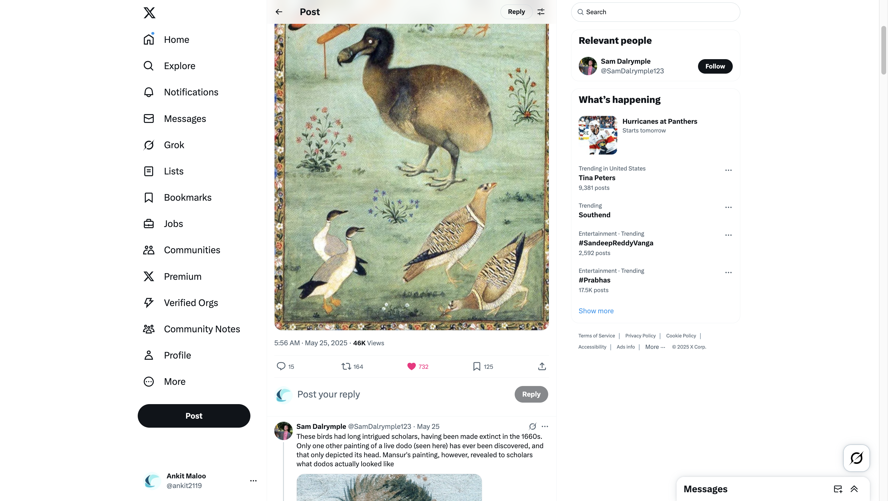

# Sam Dalrymple on X: "The Royal Mughal Dodo In 1958, a group of Soviet ornithologists stumbled across something extraordinary in the vaults of the Hermitage Museum in St Petersburg: a Mughal painting of a dodo. Attributed to Ustad Mansur, it quickly caused an academic frenzy. https://t.co/R52FlzOhMw" / X

- URL: [https://x.com/SamDalrymple123/status/1926623527622369672](https://x.com/SamDalrymple123/status/1926623527622369672)
- Saved on: 2025-05-26

## Screenshot

