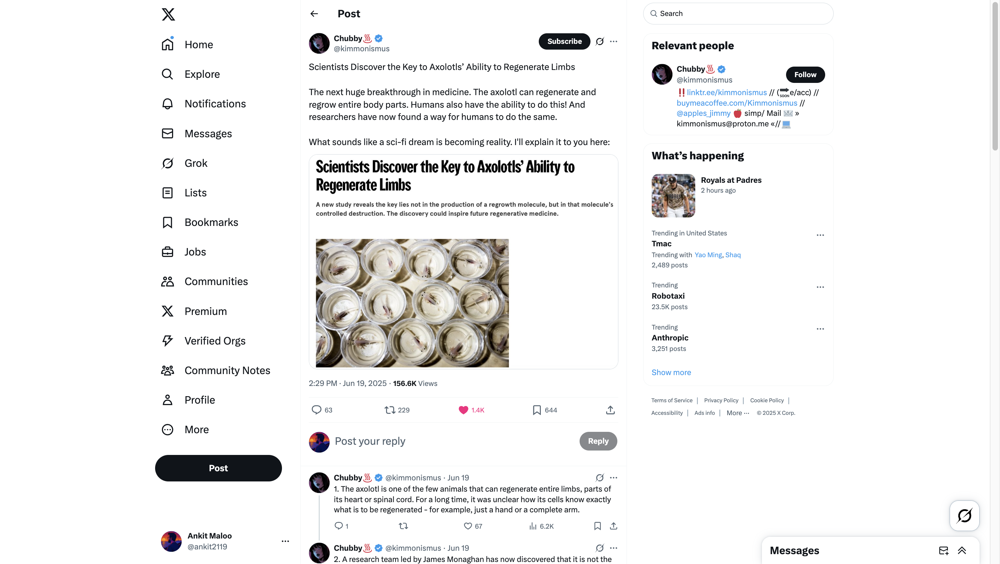

# Chubby♨️ on X: "Scientists Discover the Key to Axolotls’ Ability to Regenerate Limbs The next huge breakthrough in medicine. The axolotl can regenerate and regrow entire body parts. Humans also have the ability to do this! And researchers have now found a way for humans to do the same. What https://t.co/Sv8bZqFMrZ" / X

- URL: [https://x.com/kimmonismus/status/1935812090339717153](https://x.com/kimmonismus/status/1935812090339717153)
- Saved on: 2025-06-21

## Screenshot

